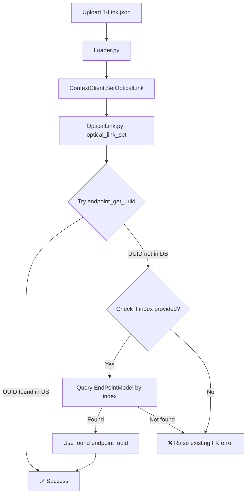

# Index-Based Endpoint Lookup for Optical Links

## Problem Summary

When creating optical links via JSON descriptor, using endpoint names instead of real UUIDs fails because the UUID hash depends on topology context. The new `index` field (unique per endpoint) provides a fallback lookup mechanism.

**Key constraint**: Existing behavior must remain unchanged. Only add fallback when UUID resolution fails.

---

## Workflow

---

## Proposed Changes

### Proto & Generated Files

#### [MODIFY] [context.proto](file:///home/tfs/teraflow/teraflow-develop/proto/context.proto)

- Add optional `index` field (field number 2) to `Uuid` message for index-based fallback

---

### Context Service Database

#### [MODIFY] [OpticalLink.py](file:///home/tfs/teraflow/teraflow-develop/src/context/service/database/OpticalLink.py)

- Import `EndPointModel` for database queries
- Add helper function `resolve_endpoint_uuid_with_index_fallback()` to:
  - Try existing `endpoint_get_uuid()` first
  - If endpoint not found in DB, check for `index` field
  - Query `EndPointModel` by `index` column
  - Return found `endpoint_uuid` or raise original error
- Replace direct call to `endpoint_get_uuid()` with the new helper

---

## Files Modified (After Implementation)

| File | Changes |
|------|--------|
| [context.proto](file:///home/tfs/teraflow/teraflow-develop/proto/context.proto) | Added `index` field (field 2) to `Uuid` message for index-based fallback lookup |
| [OpticalLink.py](file:///home/tfs/teraflow/teraflow-develop/src/context/service/database/OpticalLink.py) | Added `EndPointModel` import; Added `resolve_endpoint_uuid_with_index_fallback()` helper function; Modified `optical_link_set()` to resolve endpoints inside transaction callback using the new helper |

---

## Services to Rebuild

| Service | Notes |
|---------|-------|
| Proto files | Regenerate after context.proto change |
| Context Service | Rebuild/restart after OpticalLink.py change |

---

## Verification Plan

### Manual Testing

1. **Test Case 1 - Existing behavior (UUID-based)**:
   - Use descriptor with **real endpoint UUIDs**
   - Expected: Link created successfully ✅

2. **Test Case 2 - Index fallback**:
   - Use `1-Link.json` with `index` field
   - Expected: Link created via index fallback ✅
   - Check logs for: `"Endpoint found via index:"`

3. **Test Case 3 - Both fail**:
   - Use descriptor with wrong UUID and wrong/missing index
   - Expected: Original FK violation error ❌
