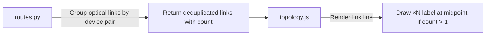

# Parallel Links Visualization Plan

## Problem Summary

Parallel optical links between the same two devices are drawn as overlapping lines, making only one visible. The solution is to show a count label (e.g., `×3`) on the link.

---

## Design Decisions

| Decision | Answer |
| -------- | ------ |
| Label format | `×3` |
| Click to show details? | No (keep simple) |
| Apply to which links? | Optical links only |
| Treat A→B and B→A as same? | Yes (bidirectional) |

---

## Workflow

---

## Implementation

### [MODIFY] routes.py

- Group optical links by normalized `(source, target)` pair (sorted to treat as bidirectional)
- Return deduplicated list with `count` field for each unique pair

### [MODIFY] topology.js

- Add text labels at midpoint of optical links
- Display `×N` only when count > 1
- Style: small font, positioned at link center

---

## Files Modified (After Implementation)

| File | Changes |
|------|---------|
| [routes.py](file:///home/tfs/teraflow/teraflow-develop/src/webui/service/main/routes.py) | Group optical links by normalized device pair (bidirectional), add `count` field to each unique pair |
| [topology.js](file:///home/tfs/teraflow/teraflow-develop/src/webui/service/templates/js/topology.js) | Add `optical_link_labels` variable, render `×N` text at link midpoints for count > 1, update label positions in ticked() |

---

## Services to Rebuild

| Service | Notes |
|---------|-------|
| WebUI | Restart after routes.py and topology.js changes |
