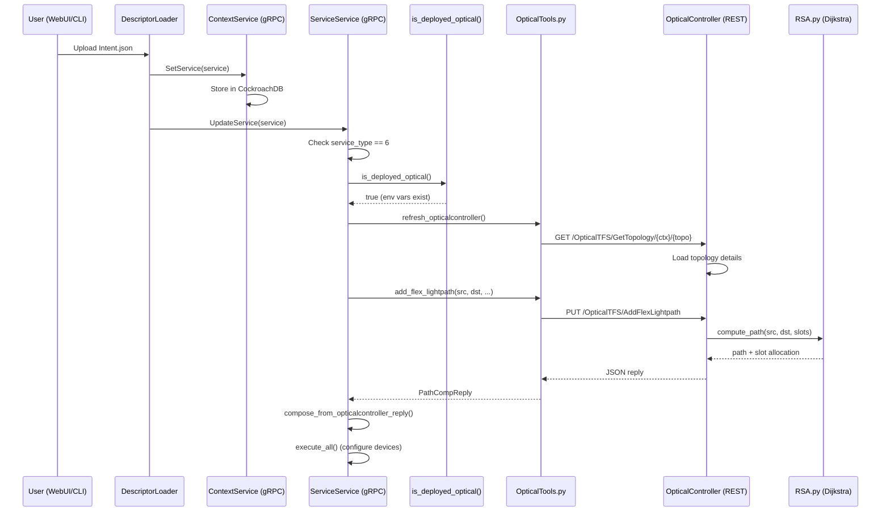

# Understanding Optical Intent Flow in TeraFlowSDN

## Executive Summary

When you post a service intent with `service_type=6`, the **ServiceService** (a gRPC microservice) checks if the **OpticalController** is deployed, then makes **HTTP REST calls** to the OpticalController Flask API. The OpticalController is deployed as a Kubernetes pod but communicates via REST, not gRPC.

---

## Service Type Definition

### Where is `service_type=6` defined?

**Location**: [proto/context.proto#L360-375](proto/context.proto#L360-375)

```protobuf
enum ServiceTypeEnum {
  SERVICETYPE_UNKNOWN = 0;
  SERVICETYPE_L3NM = 1;
  SERVICETYPE_L2NM = 2;
  SERVICETYPE_TAPI_CONNECTIVITY_SERVICE = 3;
  SERVICETYPE_TE = 4;
  SERVICETYPE_E2E = 5;
  SERVICETYPE_OPTICAL_CONNECTIVITY = 6;  // <-- optical intent type
  SERVICETYPE_QKD = 7;
  SERVICETYPE_L1NM = 8;
  // ... more types
}
```

> [!IMPORTANT]
> `service_type=6` corresponds to `SERVICETYPE_OPTICAL_CONNECTIVITY`

---

## How the Intent is Processed

### Complete Flow Diagram



---

## Key Files and Their Roles

### 1. ServiceService (gRPC Entry Point)

**File**: [src/service/service/ServiceServiceServicerImpl.py](/src/service/service/ServiceServiceServicerImpl.py)

The `UpdateService()` method (lines 109-371) is the main entry point. Key section for optical:

```python
# Line 257
if is_deployed_optical() and service.service_type == ServiceTypeEnum.SERVICETYPE_OPTICAL_CONNECTIVITY:
    # ... call OpticalTools functions
    refresh_opticalcontroller(topology_id_x)  # Sync topology
    reply_txt = add_flex_lightpath(src, dst, bitrate, bidir, ob_band)  # Request path
```

---

### 2. Deployment Detection

**File**: [src/common/Settings.py#L117-126](/src/common/Settings.py#L117-126)

```python
def is_microservice_deployed(service_name : ServiceNameEnum) -> bool:
    host_env_var_name = get_env_var_name(service_name, ENVVAR_SUFIX_SERVICE_HOST)
    port_env_var_name = get_env_var_name(service_name, ENVVAR_SUFIX_SERVICE_PORT_GRPC)
    return (host_env_var_name in os.environ) and (port_env_var_name in os.environ)

def is_deployed_optical() -> bool: 
    return is_microservice_deployed(ServiceNameEnum.OPTICALCONTROLLER)
```

**Required Environment Variables**:

- `OPTICALCONTROLLERSERVICE_SERVICE_HOST`
- `OPTICALCONTROLLERSERVICE_SERVICE_PORT_GRPC`

These are automatically set by Kubernetes when the service is deployed.

---

### 3. OpticalTools (HTTP Client)

**File**: [src/service/service/tools/OpticalTools.py](/src/service/service/tools/OpticalTools.py)

This module provides HTTP client functions to call the OpticalController REST API:

| Function | HTTP Method | Endpoint |
|----------|-------------|----------|
| `refresh_opticalcontroller()` | GET | `/OpticalTFS/GetTopology/{ctx}/{topo}` |
| `add_flex_lightpath()` | PUT | `/OpticalTFS/AddFlexLightpath/{src}/{dst}/{bitrate}/{bidir}` |
| `add_lightpath()` | PUT | `/OpticalTFS/AddLightpath/{src}/{dst}/{bitrate}/{bidir}` |
| `get_optical_band()` | GET | `/OpticalTFS/GetOpticalBand/{idx}` |
| `DelFlexLightpath()` | DELETE | `/OpticalTFS/DelFlexLightpath/...` |
| `get_lightpaths()` | GET | `/OpticalTFS/GetLightpaths` |

---

### 4. OpticalController (Flask REST API)

**Directory**: [src/opticalcontroller/](file:///home/tfs/teraflow/teraflow-develop/src/opticalcontroller)

| File | Purpose |
|------|---------|
| `OpticalController.py` | Flask app with REST endpoints |
| `RSA.py` | Route & Spectrum Assignment algorithms |
| `dijkstra.py` | Shortest path computation |
| `tools.py` | Helper functions |

**Flask App Definition** (OpticalController.py, line 35):

```python
app = Flask(__name__)
api = Api(app, version='1.0', title='Optical controller API',
          description='Rest API to configure OC Optical devices in TFS')

# Runs on port 10060
if __name__ == '__main__': 
    app.run(host='0.0.0.0', port=10060, debug=True)
```

---

## OpticalController Kubernetes Deployment

**File**: [manifests/opticalcontrollerservice.yaml](file:///home/tfs/teraflow/teraflow-develop/manifests/opticalcontrollerservice.yaml)

```yaml
apiVersion: apps/v1
kind: Deployment
metadata:
  name: opticalcontrollerservice
spec:
  containers:
    - name: server
      image: localhost:32000/tfs/opticalcontroller:dev
      ports:
        - containerPort: 10060  # REST API
        - containerPort: 9192   # Metrics
---
apiVersion: v1
kind: Service
metadata:
  name: opticalcontrollerservice
spec:
  ports:
    - name: grpc        # Mislabeled but actually REST
      port: 10060
```

> [!NOTE]
> The port is named "grpc" in the manifest but the OpticalController actually uses HTTP/REST, not gRPC.

---

## Why No Logs with `show_logs_opticalcontroller.sh`?

The script runs:

```bash
kubectl --namespace $TFS_K8S_NAMESPACE logs deployment/opticalcontrollerservice -c server
```

**Possible Reasons for No Output**:

1. **OpticalController not deployed**: Check with `kubectl get pods -n tfs | grep optical`
2. **Pod crashed/restarted**: Check `kubectl get pods -n tfs` for restarts
3. **Logs already consumed**: Flask logging might be minimal by default
4. **Environment variables missing**: `is_deployed_optical()` returns false, so ServiceService doesn't call OpticalController

**Debug Steps**:

```bash
# Check if deployed
kubectl get deployments -n tfs | grep optical

# Check pod status
kubectl get pods -n tfs | grep optical

# Check environment in serviceservice
kubectl exec -n tfs deployment/serviceservice -- env | grep OPTICAL

# Direct logs with timestamps
kubectl logs -n tfs deployment/opticalcontrollerservice --timestamps
```

---

Due to some changes in the database the official controller is breaking. After the development of our parallel-optical-controller, this section will be updated.
