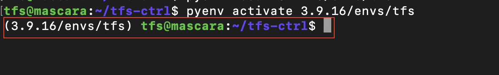

# How to initialize the Controller for Development

After installation we have to perform some configuration to get the system ready for additional development.

Virtual Python Environment is preferred by the official documentation, we will now configure a virtual environment in our node to proceed.

## Necessary commands

```bash
sudo apt-get update -y
sudo apt-get dist-upgrade -y
sudo apt-get install -y make build-essential libssl-dev zlib1g-dev libbz2-dev libreadline-dev libsqlite3-dev wget curl llvm git libncursesw5-dev xz-utils tk-dev libxml2-dev libxmlsec1-dev libffi-dev liblzma-dev
curl https://pyenv.run | bash
# When finished, edit ~/.bash_profile // ~/.profile // ~/.bashrc as the installer proposes.
# In general, it means to append the following lines to ~/.bashrc:
export PYENV_ROOT="$HOME/.pyenv"
command -v pyenv >/dev/null || export PATH="$PYENV_ROOT/bin:$PATH"
eval "$(pyenv init -)"
eval "$(pyenv virtualenv-init -)"
source "$HOME"/.bashrc
sudo reboot #after that you have to run the commands again for the Teraflow deployment
pyenv install --list | grep " 3.9"
pyenv install 3.9.16
cd ~/tfs-ctrl
pyenv virtualenv 3.9.16 tfs
pyenv local 3.9.16/envs/tfs
pyenv activate 3.9.16/envs/tfs #that activates the venv in the directory and you get something like this:
```



## Required libraries(libyang in particular)

After configuring `pyenv` we have install required libraries for the development. For that:

```bash
cd ~/tfs-ctrl
./install_requirements.sh #should be install under pyenv no on root python 

#the installation might take a while and ask you to reboot your system but if you have updated your distro earlier the installation process will automatically detect it and pass.
logout
```

The components, e.g., microservices, of the TeraFlowSDN controller, in general, use a gRPC-based open API to interoperate. All the protocol definitions can be found in sub-folder proto within the root project folder. For additional details on gRPC, visit the official web-page gRPC.

```bash
cd ~/tfs-ctrl
proto/generate_code_python.sh
```
