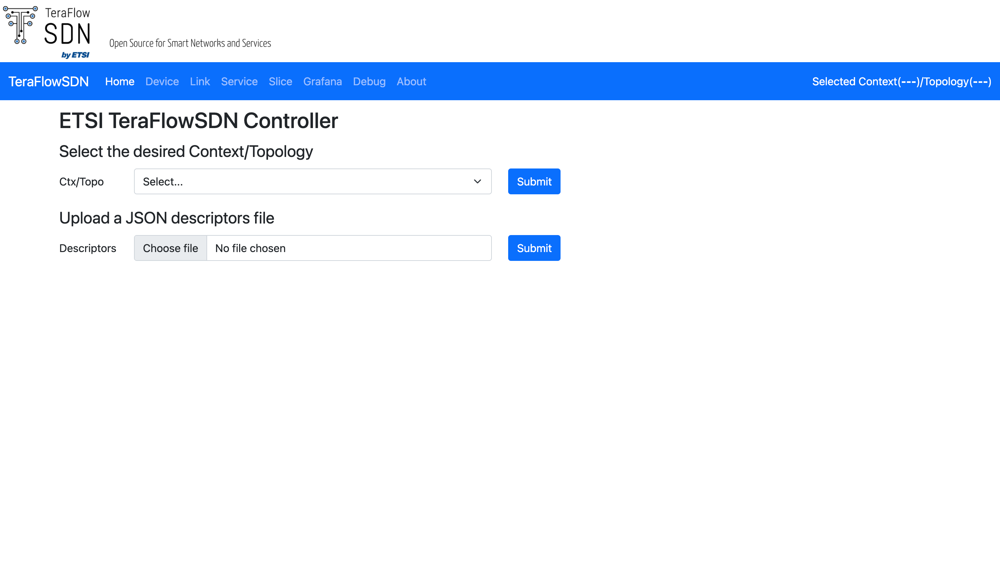

# Deploying TeraFlowSDN

This section describes how to deploy TeraFlowSDN controller on top of MicroK8s using the environment configured in the previous sections.

## Installation of prerequisites

```bash
sudo apt-get install -y git curl jq
```

## Clone the Git repository of the TeraFlowSDN controller

```bash
mkdir ~/tfs-ctrl
git clone https://labs.etsi.org/rep/tfs/controller.git ~/tfs-ctrl

cd ~/tfs-ctrl
#you can build the `develop` version
#git checkout develop
#but I build the master
source my_deploy.sh
./deploy/all.sh
```

## If the build is successful

Normally the build should success, but in my case the `webui` containers were not created thus the pipeline failed to put everything together. **After the build a summary chart will appear on your terminal** where you can verify if the required pods are running and fed to the pipeline. If you see any pod failed, check the `microk8s` resources and addons related to that service and run the `./deploy/all.sh` command again. For me it worked second time.

## The WebUI

The WebUI is exposed at this URL `http://localhost/webui` which brings you to this interface.



The next steps involves configuring the Controller, and for that you can go through these discussions.
