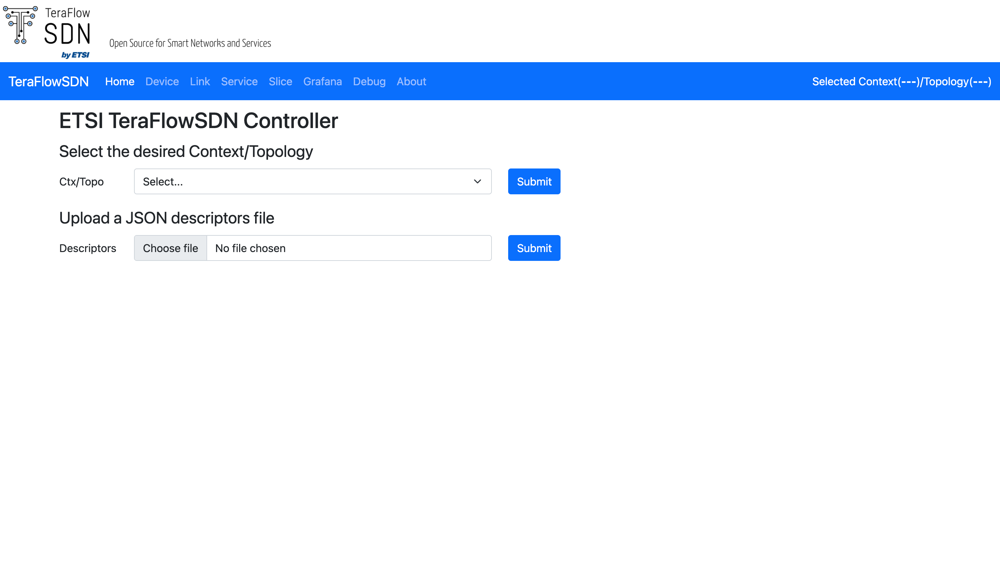

# Deploying TeraFlowSDN

This section describes how to deploy TeraFlowSDN controller on top of MicroK8s using the environment configured in the previous sections.

## Installation of prerequisites

```bash
sudo apt-get install -y git curl jq
```

## Clone the Git repository of the TeraFlowSDN controller

```bash
mkdir ~/tfs-ctrl
git clone https://labs.etsi.org/rep/tfs/controller.git ~/tfs-ctrl

cd ~/tfs-ctrl
#you can build the `develop` version
#git checkout develop
#but I build the master
source my_deploy.sh
./deploy/all.sh
```

## If the build is successful

Normally the build should success, but in my case the `webui` containers were not created thus the pipeline failed to put everything together. **After the build a summary chart will appear on your terminal** where you can verify if the required pods are running and fed to the pipeline. If you see any pod failed, check the `microk8s` resources and addons related to that service and run the `./deploy/all.sh` command again. For me it worked second time.

## The WebUI

The WebUI is exposed at this URL `http://localhost/webui` which brings you to this interface.



The next steps involves configuring the Controller, and for that you can go through these discussions.

## Grafana Dashboard

Username: admin
Password: tfs123

## Re-Deployment

## In case just in case

I hope this day never come -_-

Find below some additional commands you might need while you work with MicroK8s:

```bash
microk8s.stop  # stop MicroK8s cluster (for instance, before power off your computer)
microk8s.start # start MicroK8s cluster
microk8s.reset # reset infrastructure to a clean state, will fail for mode than 1 node
```

### Make sure you restart your machine now

```bash
sudo reboot
```

If you are executing the commands above(you are done bro). I hope this day never come for me, god is merciful.

microk8s.reset # resets infrastructure to a clean state but will fail if you have more than 1 node.

### If you are stuck in `microk8s.reset`

It is very normal that your `reset` command is stuck at some point. It happens due to a pod stuck in the Terminating state or persistent volume claims being deleted. In that case these are the solutions you have:

- Force delete stuck pods:

```bash
microk8s kubectl delete pod <PODNAME> --grace-period=0 --force
```

- Delete stuck CRDs:

```bash
microk8s kubectl delete crd <CRDNAME>
```

After that try the `reset` again.

### The easiest solution is to remove microK8 completely and re-install

```bash
#if you are not patient enough :/
sudo snap remove microk8s --purge
sudo apt-get remove --purge docker.io docker-buildx
sudo rm -rf /etc/docker
sudo reboot
```

You can fix one by one but it keeps coming. So at last I stopped and pursued the easiest solution. This saves time.

## If you have `reset` successfully but having problems enabling `ingress` and `registry`

Check this for [for-ingress](#microk8senable-ingress-fails).

### for removing registry

```bash
microk8s disable registry --force
microk8s kubectl get ns container-registry -o jsonpath='{.status.phase}{"\n"}'
#because we used `jq`
microk8s kubectl get ns container-registry -o json \
| jq '.spec.finalizers=[]' \
| microk8s kubectl replace --raw /api/v1/namespaces/container-registry/finalize -f -
#optional just to make sure everything is wiped out
microk8s kubectl -n container-registry get all,pvc,events
microk8s kubectl patch pvc registry-claim -n container-registry \
  -p '{"metadata":{"finalizers":null}}' --type=merge || true
PV=$(microk8s kubectl get pv | awk '/registry/{print $1}')
[ -n "$PV" ] && microk8s kubectl patch pv "$PV" \
  -p '{"metadata":{"finalizers":null}}' --type=merge || true
microk8s kubectl delete ns container-registry --force --grace-period=0 || true
microk8s kubectl get ns | grep container-registry || echo "namespace removed"
```

Then enable `registry` again.

## If `CockroachDB` is stuck while re-deploying

Remove finalizers from any leftover objects (only if the sweep printed any):

```bash
# show objects that still have finalizers
for r in $(microk8s kubectl api-resources --verbs=list --namespaced -o name); do
  microk8s kubectl -n crdb get "$r" -o json 2>/dev/null \
  | jq -r '.items[] | select(.metadata.finalizers) | "\(.kind)/\(.metadata.name)"'
done

# strip finalizers on those (example for EndpointSlice kind)
microk8s kubectl -n crdb get endpointslices.discovery.k8s.io -o name \
| xargs -r -n1 microk8s kubectl -n crdb patch --type=merge -p '{"metadata":{"finalizers":[]}}'
```

```bash
microk8s kubectl get ns crdb -o json \
| jq '.spec.finalizers=[]' \
| microk8s kubectl replace --raw /api/v1/namespaces/crdb/finalize -f -
microk8s kubectl get ns | grep -E '^crdb\s' || echo "crdb namespace removed"
```

## ***(don't try this) But this day came for me :) 25-09-2025 and I am having fun :(

`It is very normal to change the HOSTNAME of your node(vm, physical-machine)` but remember this! If you were running `pods` before and you have changed the hostname, most likely everything will fail because K8 will consider the hostname with new name as a second node. So, if you are not actually on a second node remove the previous node and reset.

```bash
microk8s kubectl get nodes -o wide
microk8s remove-node node-name
```

### to remove all pods and namspaces

```bash
microk8s.kubectl delete pods --all --all-namespaces
microk8s.kubectl delete all --all --all-namespaces
```

### microk8s.enable ingress fails

Yes, in second build it fails because there were existing API configurations based on previous node. Since, this is the same machine but with different name we have to reset the API addon.

```bash
#remove
microk8s.kubectl delete validatingwebhookconfiguration nginx-ingress-microk8s-admission --ignore-not-found
microk8s.kubectl delete mutatingwebhookconfiguration  nginx-ingress-microk8s-admission --ignore-not-found
#reset
microk8s.kubectl get ns ingress -o json \
| jq '.spec.finalizers=[]' \
| microk8s.kubectl replace --raw /api/v1/namespaces/ingress/finalize -f -
#verify
microk8s.kubectl get ns ingress # should return NotFound
microk8s.enable ingress
```

Then repeat the steps before.

## microk8s.enable registry fails :(

```text
Error from server (Forbidden): error when creating "STDIN": persistentvolumeclaims "registry-claim" is forbidden: unable to create new content in namespace container-registry because it is being terminated.
```

Well this was a very big mess. But we solved it with our friend chatgpt :). Behold and go through if you are already reading:

```bash
#try to delete namespaces
for r in $(microk8s.kubectl api-resources --namespaced -o name); do
  microk8s.kubectl -n container-registry delete "$r" --all --ignore-not-found >/dev/null 2>&1
done
#check which pv(s) are running
microk8s.kubectl get pv -o wide
#remove them
microk8s.kubectl delete pv NAME
#check for existing volume
sudo ls -1 /var/snap/microk8s/common/default-storage
#if any of them are mounted you have to unmount them
mount | grep /var/snap/microk8s/common/default-storage || true
#remove them
sudo rm -rf /var/snap/microk8s/common/default-storage/NAME
#check for existing registry
microk8s.kubectl get ns container-registry
#in my case it was still stuck at Terminating
for r in $(microk8s.kubectl api-resources --namespaced -o name); do
  microk8s.kubectl -n container-registry delete "$r" --all --ignore-not-found >/dev/null 2>&1
done

for r in $(microk8s.kubectl api-resources --namespaced -o name); do
  microk8s.kubectl -n container-registry get "$r" -o name 2>/dev/null \
  | xargs -r -I{} microk8s.kubectl -n container-registry patch {} \
      --type=merge -p '{"metadata":{"finalizers":[]}}' >/dev/null 2>&1
done

#still it was there so I had to hard reset
microk8s.kubectl get ns container-registry -o json >/tmp/ctrreg-ns.json
python3 - <<'PY'
import json; p="/tmp/ctrreg-ns.json"; d=json.load(open(p))
d.setdefault("spec",{})["finalizers"]=[]
json.dump(d, open(p,"w"))
PY
microk8s.kubectl replace --raw /api/v1/namespaces/container-registry/finalize -f /tmp/ctrreg-ns.json
#finally it was gone
microk8s.kubectl get ns container-registry || echo "container-registry namespace removed"
microk8s.enable registry
```

## microk8s.enable prometheus fails :(

```text
Release "kube-prom-stack" does not exist. Installing it now.
Error: create: failed to create: secrets "sh.helm.release.v1.kube-prom-stack.v1" is forbidden: unable to create new content in namespace observability because it is being terminated.
```

Let's fix this as well,

```bash
# 1) Try to remove any Helm leftovers in the ns (quiet if none)
microk8s.kubectl -n observability delete secret -l owner=helm --ignore-not-found
microk8s.kubectl -n observability delete configmap -l owner=helm --ignore-not-found
microk8s.kubectl -n observability delete secret sh.helm.release.v1.kube-prom-stack.v1 --ignore-not-found

# 2) Delete EVERYTHING in the namespace (even if it looks empty)
for r in $(microk8s.kubectl api-resources --namespaced -o name); do
  microk8s.kubectl -n observability delete "$r" --all --ignore-not-found >/dev/null 2>&1
done

# 3) If anything still exists with finalizers, strip them
for r in $(microk8s.kubectl api-resources --namespaced -o name); do
  microk8s.kubectl -n observability get "$r" -o name 2>/dev/null \
  | xargs -r -I{} microk8s.kubectl -n observability patch {} \
      --type=merge -p '{"metadata":{"finalizers":[]}}' >/dev/null 2>&1
done

# 4) Force-finalize the namespace
microk8s.kubectl get ns observability -o json >/tmp/obs-ns.json
python3 - <<'PY'
import json; p="/tmp/obs-ns.json"; d=json.load(open(p))
d.setdefault("spec",{})["finalizers"]=[]  # remove the 'kubernetes' finalizer
json.dump(d, open(p,"w"))
PY
microk8s.kubectl replace --raw /api/v1/namespaces/observability/finalize -f /tmp/obs-ns.json

# 5) Verify it's gone
microk8s.kubectl get ns observability || echo "observability namespace removed"

#enable now
microk8s.enable prometheus
```
