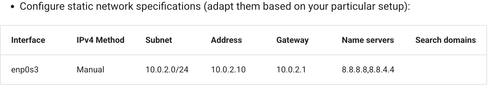
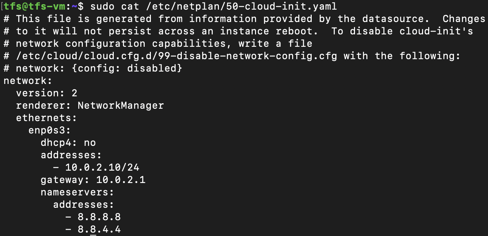

# Setting up the static network for `TFS` internal communication

**Remember this step is necessary if you are using a VM inside your machine.** Our target is to setup this network:



we will use our existing network orchestrator `netplan` to configure this network.

```bash
sudo nano /etc/netplan/50-cloud-init.yaml
```

after that the configuration looks like this:



And now the the actual installation begins. You can find [it here](README.md).
