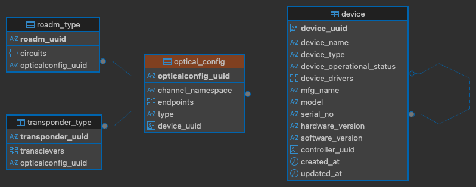
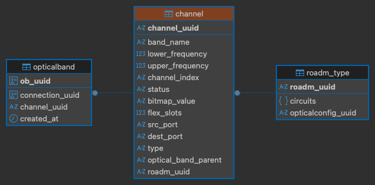
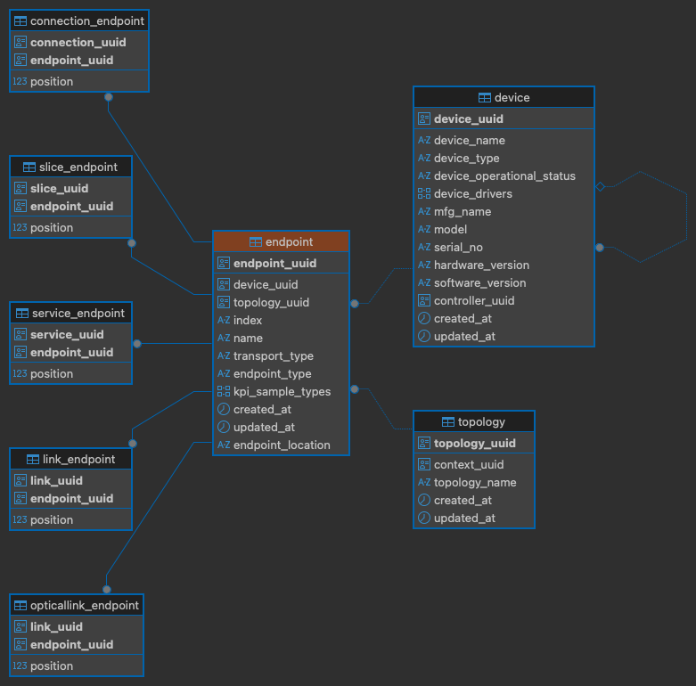
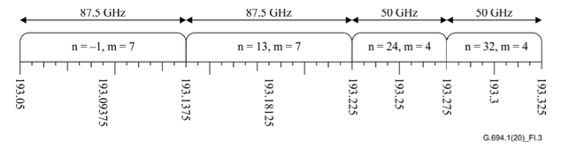
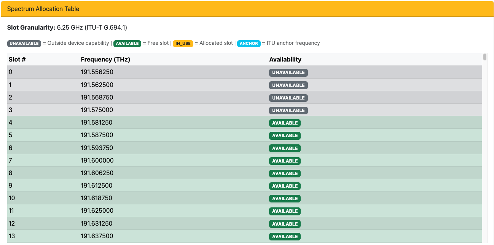
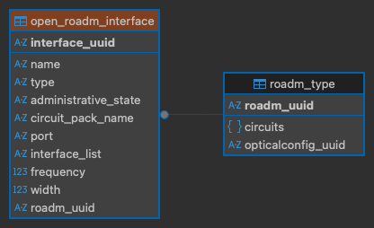

# The final part of the Thesis

We are going to integrate our ***RSA*** project in TeraFlowSDN. For that I have removed the repository from github and moved it to [***GitLAB***](https://gitlab.com/thesis-group1/teraflow.git). I am a free user, so the repository is private. If you need access please send me an [email](mailto:a.bhuiyan@studenti.unipi.it).

## Testbed setup

1. Creating the Docker Network  ***UniPi Server: Monster***

    ```bash
    # use your deisred subnet
    sudo docker network create --driver=bridge --ip-range=10.100.0.0/16 --subnet=10.100.0.0/16 -o "com.docker.network.bridge.name=brTFS" netbrTFS
    ```

2. Add route in ***UniPi Server: Mascara***

    ```bash
    # use your own server's IP address and used subnet for docker
    sudo ip route add 10.100.0.0/16 via 131.114.54.73
    # check the route
    route -n
    ```

3. Add route in ***UniPi Server: Monster***

    This solution worked with debian bullseye, but after upgrading the OS to ubuntu 22.04 broke the persistency and I had to adapt new changes. But if you are using an old linux distro try this.

    ```bash
    # make sure you execute this each time you reboot, or make it permanent
    sudo iptables -I DOCKER-USER -s 131.114.54.72 -d 10.100.0.0/16 -j ACCEPT
    
    # check if added successfully
    sudo iptables --list
    ```

    ***Important***

    If not then follow [these steps](../2026-03/setup_network.sh) for new linux distributions. Then you have to use this [script](../2026-03/fixConnectivity.sh) for fixing the network issue each time you generate a topology.

4. For muxponder and roadm device configuration I have used professor alessio and andrea's existing files with slight modifications to match the driver's information retrieval. For muxponders use this [file](./transponders_x4.xml) and for roadms use this [file](./roadm.xml). I suggest you to follow this [pattern](../2026-03/topo_3_10_3/testTopo_3_10_3.sh) to design your topology scripts.

5. Try to ping the *Emulated Device* from ***UniPi Server: Mascara***

    ```bash
    # find the device in Monster
    docker inspect -f '{{.Name}} - {{range .NetworkSettings.Networks}}{{.IPAddress}}{{end}}' $(docker ps -q)
    # ping from Mascara
    ping 10.100.101.1
    ```

## Modifications on OCDriver: openconfig-devices

We want to store some additional information from the device to perform device based filtration. Currently we don't have any information related to manufacturer. So, we will add some columns  in the database table [***DeviceModel.py : src/context/service/database/models/DeviceModel.py***]. Device [***name, type, and driver***] is already present in the database.

1. Use the teraflow [descriptor](../2025-11/1_TP.json) to add the device to the controller.

2. The discovery of ***Device Name***

    >Filename: OCDriver.py[enum: 11] [teraflow-develop/src/device/service/drivers/oc_driver/OCDriver.py]

    Right now the ***Device Name*** is selected from the ***JSON*** descriptor. It doesn't read from the ***xml*** configuration file.

3. Adding new attributes to ***DeviceModel.py***

    We are adding [ ***mfg_name, model, serial_no, hardware_version, software_version*** ]

    - mfg_name, model, serial_no is mandatory to have a value
    - hardware_version, software_version is nullable

4. Modifying ***OCDriver.py*** to accept new values

    - added new file filters.py along with transponders.py to shift all the filters there
    - the helper function resides in transponders.py and OCDriver as the parent
    - check [Problem-1](./TFS_Integration_problems.md#no-device-info-received-by-the-controller)
5. Generating proto buffers ***context.proto*** and Context Service

    - added protos in context.proto and generated python codes for them using the script given in the directory
    - proto buffers are confirmed in **proto/src/python/context_pb2.py** file
    - added new fields in src/context/service/database/Device.py:device_data, callback
    - src/device/service/OpenConfigServicer.py contains the data we added. Before this, the device details were added from the JSON descriptor. Since we are adding from the device itself we must put this information in the servicer for passing through services.

6. Visualizing the ***changes*** in ***WebUI***

    - /src/webui/service/templates/device/detail.html contains new data fields
    - src/webui/service/device/routes.py, contains the controller
7. [2026-03-01] I encountered a new issue related to netconf session handling. Teraflow keeps DeviceDriverCaches for better device management. This is an useful feature but for frequent topology changes it reacts. As in my thesis I was changing the topologies frequently, adding devices with these caches introduced malformed transport type errors which failed the connection to the emulators. The problem and solution has been detailed in this [document](../2026-03/netconf_errors.md).
8. Rebuilding the ***Services***

    - rebuild ***CockRoachDB***

        ```bash
        export CRDB_DROP_DATABASE_IF_EXISTS="YES"
        export CRDB_REDEPLOY="YES"
        bash deploy/crdb.sh 
        ```

    - rebuild ***ContextService***

        ```bash
        docker build -t localhost:32000/tfs/context:dev -f src/context/Dockerfile .
        docker push localhost:32000/tfs/context:dev
        kubectl rollout restart deployment/contextservice -n tfs
        ```

    - rebuild ***DeviceService***

        ```bash
        docker build -t localhost:32000/tfs/device:dev -f src/device/Dockerfile .
        docker push localhost:32000/tfs/device:dev
        kubectl rollout restart deployment/deviceservice -n tfs
        ```

    - rebuild ***WebUI***

        ```bash
        docker build -t localhost:32000/tfs/webui:dev -f src/webui/Dockerfile .
        docker push localhost:32000/tfs/webui:dev
        kubectl rollout restart deployment/webuiservice -n tfs
        ```

### Enhancement of Device Endpoints aka PORTS : Muxponder

---
Let's see an example of the current workflow:
Right now TFS ***OCDriver*** is reading ***port-11*** from the ***xml*** components and splitting the integer as name. Finally, the output becomes: name: 11, endpoint_type: port-11. Which is a bit confusing, so we will try put it according to the standard.

```xml
<component>
    <name>port-1</name>  ← Component name
    <state>
        <name>port-1</name>  ← State name (endpoint_type)
        <type>typex:PORT</type>  ← Type filter
    </state>
    <subcomponents>...</subcomponents>
    <properties>
        <property>
            <name>onos-index</name>
            <value>1</value>  ← Port index (endpoint name in DB)
        </property>
    </properties>
</component>
```

```python
# Location: line 333-365
# Searches for: components with "port" in name
for component in components:
    name = component.find('.//oc:name').text  # Gets "port-1"
    if "port" in name:
        port_index = name.split("-")[1]  # Extracts "1"
        port = (name, port_index)        # Creates ("port-1", "1")
        ports.append(port)
```

Since we are going to add quite a few attributes, let's go one by one. First we are going to start with the ***index, name and endpoint_type***. Name and endpoint_type is already there so, we will start with index.

We want to extract and store additional endpoint information from devices to enable better endpoint identification and filtering. Currently, endpoints lack detailed indexing and transport type classification. We will add `index` and `transport_type` columns to the database table [***EndPointModel.py : endpoint***] and implement model-based filtering for vendor-specific XML parsing.

1. Use the teraflow descriptor to add the device (e.g., transponder) to the controller.

2. **Creating Model-Based Device Filters**

    >Filename: device_filters [teraflow-develop/src/device/service/drivers/oc_driver/device_filters/]

    Created a new package for device-specific filter classes:
    - **DefaultDevice.py**: Fallback filters for unknown devices with generic patterns
    - **MellanoxSwitch.py**: Specific filters for Mellanox transponders (optical channels)
    - ****init**.py**: Package initialization exporting filter classes

3. **Updating filters.py with Model Mapping**

    >Filename: filters.py [teraflow-develop/src/device/service/drivers/oc_driver/filters.py]

    - Added `OC_TRANSPORT_TYPES` namespace for transport type constants
    - Created `MODEL_FILTER_MAP` dictionary mapping model names to filter classes
    - Implemented `get_device_filter(model_name)` function to return appropriate filter instance

4. **Adding New Attributes to EndPointModel.py**

    >Filename: EndPointModel.py [teraflow-develop/src/context/service/database/models/EndPointModel.py]

    We are adding [***index, transport_type***]
    - Both fields are nullable (String type)
    - Updated `dump()` and `dump_name()` methods to include new fields

5. **Modifying transponders.py with Two-Phase Extraction**

    >Filename: transponders.py [teraflow-develop/src/device/service/drivers/oc_driver/transponders.py]

    - Added helper functions: `_find_element()`, `_get_element_text()`, `_build_channel_map()`, `_extract_port_properties()`, `_get_channel_name_from_port()`
    - Rewrote `extract_ports_based_on_type(xml_data, model_name)` to use model-based filters with two-phase processing:
        - Phase 1: Build channel map from optical channels
        - Phase 2: Extract port properties using channel map
    - Updated `transponder_values_extractor(xml_data, model_name)` to accept model_name and return enhanced port data with `index` and `transport_type`

6. **Modifying OCDriver.py to Extract and Pass model_name**

    >Filename: OCDriver.py [teraflow-develop/src/device/service/drivers/oc_driver/OCDriver.py]

    - Modified `GetConfig()` to extract device_info FIRST (before transponder values) to get model_name
    - Passed model_name to `transponder_values_extractor(xml_data, model_name)` for filtered extraction

7. **Updating Tools.py to Populate New Endpoint Fields**

    >Filename: Tools.py [teraflow-develop/src/device/service/drivers/tools/Tools.py]

    - Modified `populate_endpoints()` to extract and populate `device_endpoint.index` and `device_endpoint.transport_type` from resource_value dictionary

8. **Updating Device.py for Database Storage**

    >Filename: Device.py [teraflow-develop/src/context/service/database/Device.py]

    - Added `index` and `transport_type` to `endpoints_data` dictionary
    - Updated upsert statement to include both fields in `on_conflict_do_update`
    - Modified `_Base.py` to update `endpoint_device_uuid_rec_idx` index definition

9. **Generating Proto Buffers from context.proto**

    >Filename: context.proto [teraflow-develop/proto/context.proto]

    - Added `index` (field 7) and `transport_type` (field 8) to `EndPoint` message
    - Added `index` (field 5) and `transport_type` (field 6) to `EndPointName` message
    - Generated Python code using proto compilation script
    - Proto buffers confirmed in **proto/src/python/context_pb2.py** file

10. **Modified detail.html Template**

    >Filename: detail.html [teraflow-develop/src/webui/service/templates/device/detail.html, src/webui/service/device/routes.py]

    - **Added** two new table columns: `Index` and `Transport Type`
    - **Modified** table column order to: `Endpoint UUID`, `Index`, `Transport Type`, `Name`, `Type`
    - **Added** N/A handling for null/empty values: `{{ endpoint.field if endpoint.field else 'N/A' }}`
    - **Removed** `Location` column from the table

11. Rebuilding the ***Services***

    - rebuild the context, device and webui like before.

### Enhancement of the Channels : Muxponder

---
Right now when the configuration is extracted from the `xml` file, the channels and endpoints are separated and stored in different tables. The flow is the following:

- ***optical_channel***: contains the channels associated to each physical endpoints. The channels are typically the transceivers. All the details like frequency, operational mode and input/output powers are defined there. But there is another table for storing the transceivers but currently the official code is commented to store them.

- the database storage follows the current flow in the backend:\
***optical_config*** -> ***transponder_type*** -> ***optical_channel***.

- the ***channel_uuid*** is manually generated using a hash function(channel-name+device_uuid).

- but I didn't find any direct connection to map the channels to the endpoints in the database. The reason is that, channels and endpoints can be same for different devices. The device ID is the distinguisher, for these names. ***Another issue was that the channels were stored in the database before the endpoints, in different functions. So, even if we wanted to use the `endpoint_id` in optical_channels we couldn't do it, unless performing hash-reverse using channel-name and device_id.***

- the easiest solution for that was to use our ***index*** ([how indexes are generated](#how-indexes-are-generated))column from ***endpoint*** table in ***optical_config***. The index works like a unique identifier and we populated them before calling the database-manager. Later, we just passed them to each functions for database storing.

- ***src/device/service/Tools.py*** has been modified with these changes. And a sample output is such:

```json
{"endpoint_uuid": {"index": "TPA2_11", "channel": "channel-1"}}
{"endpoint_uuid": {"index": "TPA2_22", "channel": "channel-2"}}
```

- the ***index*** is also beneficial for the user to identify the device+port from the webUI. The function that sanitizes this name is located here: ***src/device/service/Tools.py:44***

#### How indexes are generated

---
The index is generated using the following algorithm:

```python
# src/device/service/Tools.py -> populate_endpoints()

device_name = fetch from the json descriptor
sanitized_name = _sanitize_device_name(device_name) # removes any non-alphanumeric characters
endpoint_index = resource_value.get('index') # return the numerical-part "port-11" -> "11"
device_endpoint.index = f"{sanitized_name}_{endpoint_index}" # TP1_11
```

Now, I have added some additional files with helpers and constants to support the development. The intention was to make the code as modular as possible, so that we can have singular point of execution for any change.

#### To define the ITU Standards

---

1. ***ITUStandards.py: [src/common/ITUStandards.py]***

    A helper with ITU-T G.694.1 optical networking standards. The helper contains the following classes:

    - **FrequencyMeasurementUnit**: Enum for frequency unit conversions (GHz, THz)
    - **ITUStandards**: Core constants (ANCHOR_FREQUENCY=193.1 THz, SLOT_GRANULARITY=6.25 GHz)
    - **FreqeuncyRanges**: Enum with min/max frequencies for each optical band (O, E, S, C, L, CL, SCL, WHOLE_BAND)
    - **Bands**: Human-readable band names ("O", "E", "S", "C", "L", "C, L", etc.)
    - **Lambdas**: Wavelength ranges in nm for each band
    - **Slots**: Number of 6.25 GHz slots per band (C_BAND=701, L_BAND=498, etc.)
    - **SlotStatus**: Availability flags (AVAILABLE, UNAVAILABLE, IN_USE)

2. ***RSATools.py: [src/common/RSATools.py]***

    This is helper is the brain of our whole research. It contains all the helper functions that have been used both in our new optical-controller, web-views and drivers.

    - **detect_band(frequency_hz, min_frequency_hz, max_frequency_hz)**: Detects the smallest optical band containing the given frequency
    - **compute_rsa_params(frequency_hz, min_frequency_hz, max_frequency_hz)**: Computes RSA parameters (min/max frequency, flex_slots, bitmap_value) for a channel
    - **detect_band_for_display(min_frequency_hz, max_frequency_hz)**: Returns band info with wavelength range for WebUI display
    - **build_spectrum_slot_table(channel_data, band_info)**: Generates slot table with availability status for WebUI
    - **_determine_slot_availability(...)**: Determines slot status (AVAILABLE/UNAVAILABLE/IN_USE) based on bitmap

    These are short descriptions, we have more in later sections.

#### Database Schema & Service Updates

---

1. ***TransponderModel.py: [src/context/service/database/models/OpticalConfig/TransponderModel.py]***

    Added new columns to `OpticalChannelModel` (table: `optical_channel`): min_frequency, max_frequency, flex_slots, bitmap_value

    Necessary modifications were made to support the cause.

2. ***OpticalConfig.py: [src/context/service/database/OpticalConfig.py]***

    Modified `set_optical_transponder()` function:

    - Updated channel_tuple to include: `min_frequency`, `max_frequency`, `flex_slots`, `bitmap_value`
    - Updated `OpticalChannelModel` upsert statement with new fields
    - Updated `on_conflict_do_update` to persist RSA fields on updates

#### Device Service - Channel Extraction

---

1. ***transponders.py: [src/device/service/drivers/oc_driver/templates/discovery_tool/transponders.py]***

    Modified channel extraction to compute RSA parameters:

    - Added import: `from common.RSATools import compute_rsa_params`
    - In channel dictionary creation, added RSA field computation:
    - Extract `frequency` from XML
    - Call `compute_rsa_params(frequency_hz)` to get band parameters
    - Populate `min_frequency`, `max_frequency`, `flex_slots`, `bitmap_value`
    - Added logging for RSA computation results

2. ***filters.py: [src/device/service/drivers/oc_driver/templates/discovery_tool/filters.py]***

    This is the helper that we used for ***OCDriver's*** device based information extraction. It inherits all the device based filtering functions and returns desired output.

#### WebUI Adjustment

---

1. ***init***.py: [teraflow-develop/src/webui/service/***init***.py]***

    Some, decorators are added in `create_app()` function for logical representation of some units and constants.

2. ***routes.py: [teraflow-develop/src/webui/service/device/routes.py]***

    Modified `endpoint_detail()` function with channel data fetching logic. Please go through the blocks with [CHAFI-THESIS-START] and [CHAFI-THESIS-END] to have a better understanding.

3. Creating Endpoint Frequency View Template

    > Filename: details.html [teraflow-develop/src/webui/service/templates/device/endpoints/details.html]

    Created comprehensive endpoint details template with:

    **Frequency Capabilities Card:**

    - Minimum/Maximum Frequency (THz)
    - Bandwidth (GHz)
    - Optical Band name (C, L, etc.)
    - Wavelength Range (nm)
    - Flexible Grid Slots count
    - Slot Granularity (6.25 GHz per ITU-T G.694.1)

    **Spectrum Allocation Table:**

    - Scrollable table with all band slots
    - Columns: Slot #, Frequency (THz), Availability
    - Color-coded status badges:
    - UNAVAILABLE (gray) - Outside device capability
    - AVAILABLE (green) - Free slot
    - IN_USE (yellow) - Allocated slot
    - ANCHOR (blue) - ITU anchor frequency (193.1 THz)
    - Summary statistics (total, available, unavailable, in-use counts)

#### How Channel data has been extracted?

---

I would like to describe this part in detail, because the database configuration for transponder devices is different the ROADM. To review the code please visit [routes.py](src/webui/service/device/routes.py) and [route_helper.py](src/webui/service/device/route_helper.py). The current logic is the following:

```python
opticalconfig_uuid = opticalconfig_uuid_get_duuid(device_uuid)
config = json.loads(opticalconfig.config) if isinstance(opticalconfig.config, str) else opticalconfig.config
endpoints = config.get('endpoints', [])
# Create lookup maps
# Map: Endpoint Index (e.g. "TPA2_11") -> Channel Name (e.g. "channel-1")
endpoint_map = {
    ep.get('endpoint_uuid', {}).get('index'): ep.get('endpoint_uuid', {}).get('channel')
    for ep in config.get('endpoints', [])
    if isinstance(ep, dict)
}
# Map: Channel Name (e.g. "channel-1") -> Channel Data
channel_map = {
    ch.get('name', {}).get('index'): ch
    for ch in config.get('channels', [])
    if isinstance(ch.get('name'), dict)
}
# Direct Lookup
target_channel_name = endpoint_map.get(endpoint_index)
channel_data_raw = channel_map.get(target_channel_name)
if channel_data_raw:
    # ... extract frequencies ...
```

### Enhancement of the Channels: ROADM

---
Before jumping into modifications, let me describe the situation before this development was conducted. I would like to start with the relational database. The database was designed properly and necessary relationship was there already. All I had to do is adding some columns and directing inputs to them. But there is one major change.

For that we have to understand how the optical-links work in teraflow. Before this development and still now [incomplete, because I haven't finished modifying functionalities], then I added `frequencies` to `channel` table for ROADM devices. And right now whenever we add a ROADM device, it will look for frequency ranges in the configuration file. If not found then it will choose the default range, which is now set to S,C,L bands. So, you can assume each OPTICAL MULTIPLEX/LINE port of a ROADM acts like a big pipe through which we have 16,875.00 GHz bandwidth. To achieve this I had to modify some files, which are the following:

- ***RoadmModel.py: [src/context/service/database/models/OpticalConfig/RoadmModel.py]***
- ***OpticalConfigModel.py: [src/context/service/database/models/OpticalConfig/OpticalConfigModel.py]***

I invite you to have a look at this files with the block [CHAFI-THESIS-START] and [CHAFI-THESIS-END]. The codes are properly commented. So, after this modifications we have channel details for each port of a ROADM device. And to get support from the driver and web, we made some modifications in the following files:

- ***OCDriver.py: [src/device/service/drivers/oc_driver/OCDriver.py]***

    In function `GetConfig()`, I have ***hard-coded*** the device model-name to apply the device based filter. Right now the emulator device I have from professor andrea doesn't support additional device info pushed through an `xml` file. I am trying to build 3 new emulators based on the emulators I have from professor alessio and professor andrea. The intention is to explore standard approaches of openconfig and openroadm, to define some standard naming conventions which might help writing filter functions for the drivers.***Update This Section In Future***

- ***roadms.py: [src/device/service/drivers/oc_driver/templates/discovery_tool/roadms.py]***

    Is where I did some modifications to extract values from the `xml` and send them to the database. For a better understanding please go through the code blocks. To connect it with the frequency details, I have used the same `ITU standard` files and `RSATools`. Here is the relational database schema(hover on the image for the caption):



This schema clearly demonstrates that whenever we add an ***optical-device***, we generate an ***optical_config*** object and a ***roadm_type*** object(because we added a ***roadm***, same goes for ***transponder*** too). Then the ***roadm_type*** object is linked to the ***channels***.



For the ***transponders*** the channel information are not stored here because this database model implicitly belongs to ***RoadmModel***. Since we have a ***optical_config*** relation between all the `optical-devices`, this table could have been made common among all. This modification(if mage), will ease the functionalities of RSA(even though its just some extra line of codes, who cares!). So, the final view from a `device` point of view is this:



From the schema it is clear that the `endpoint` has many types, but we used the main one. There is a separate table for opticallink_endpoint but I didn't use that. The reason is, I kept the existing execution of teraflow and induced my own. Since, frequencies were managed by each link before, I didn't change that part. Also, teraflow is a big eco-system and I don't know very well about other functionalities that's why I tried to use common resources. Maybe in future I will change it according the comments from my professors. But right now, a working sample was the most important part.

#### The linkup between RSATools and WebUI

---
For the web view, I have linked the `endpoint` details to the `optical_config` table. From that point the information retrieval continued as per the database relationships. Finally `RSATools` has bene used to generate the web-view. So, I think before jumping into the next point I must describe the current functionalities of the RSATools.

### RSATools: [src/common/RSATools.py]

---
Is the helper(or you can say primary knowledge container) of RSA computation for detecting bands, frequency ranges, wavelengths, slots and building spectrum table. Let us discuss each of them in detail.

#### Detecting the Band

From the `endpoint` relational point of view, we reach to the `channel`(describing from a ROADM device point of view) and fetch the operating and min, max frequency. Based on the `min` and `max` frequency, we can detect the band from the ***ITUStandard.py*** helper. After that, based on the band we select number of slots within that range and the bitmap value. The bitmap value is calculated with this formula: $bitmap = 2^{slots}-1$. This produces a large `integer` which cannot be saved as number in `postgresSql`, that is why we saved that value as string of numbers and later processed as a number using `python`(python supports larger integer numbers).

#### Bitmap Table and Slot Availability

---

By bitmap in our RSA computation we are indicating ITU G.694.1 flex slot granularity of 6.25GHz. And it doesn't matter whether we request a FIXED or FLEX, the computation is always based on 6.25GHz. And example from the standard is given below:



So, it is pretty straight forward how the computation must be conducted. We followed the same procedure, to calculate the width and the granularity. Since 6.25GHz is the minimum unit, it is convenient to perform the computation considering this as the unit. After that we logically separate the concept of fixed and flexed. And this is exactly what we did in ***RSATools.py:*** `build_spectrum_slot_table()`. We detected the band, fetched the slots and expanded them into 6.25Ghz granularity. But there is one thing worth mentioning, ***what happens if a device only support a fixed range of frequencies within a band***?

Well, this is a very common case. A transceiver may/not support the whole band but a fixed range. In that case our `build_spectrum_slot_table()` marks those slots within the band as `UNAVAILABLE`. This leads us to the next topic, the status constants used in the WEB and also in the CODE.



#### Status ENUM

---
Right now we have set a few of them in ***ITUStandards.py:*** `SlotStatus` class. The status depends on the endpoint type and slot availability. If the endpoint is of OCH type and it has been used we mark them as `FULL`, because it cannot be re-used(unless you turn it off, re-tune). But if the endpoint type is of OMS and we have an active connection, we mark it as `IN_USE` because it is a FAT channel and doesn't care about the spectrum. It is the engineers duty to be careful before transmission. So, we hope we are doing a good work, because we don't want donald trump's voice calls transmitted to china! Kaboom. This was a joke, whatever! Let's jump into our new section `openroadm` which is my favorite between the two data-models. Good definition leaves.

## Modifications on OpenROADMDriver: openroadm-devices

The workflow is 95% same like `OPENCONFIG-ROADM` devices, except a few extra things. Let me explain with the database schema, which pretty much explains the rest of 5%.



This is the only additional entry we perform(existing structure of teraflow) in database for the `OPENROADM DEVICES`. All the `circuit-packs` with their port names, frequencies, etc. are stored here. I haven't used this table for my RSA computation because, if we combine optical_config, channel and roadm_type table together then this table becomes redundant. But it doesn't mean its not useful, its just not serving my cause. But we need it 100% for device configuration(if anyone wants to make changes in interfaces).

Next, we filtered out the internal-ports from `endpoint_population()`. Because currently we are not doing anything in particular with the internal port mapping. But a good contribution can be: mapping cross connections between ports(like we do in ONOS). So, for openroadm devices we don't see the internal ports anymore in the device-details. The `client` ports are marked as TRANSPORT_TYPE: OCH and `line` ports are marked as TRANSPORT_TYPE: OMS.

## Adding Optical Links [Removed]

Right now the navigation bar doesn't have a tab where we can see the optical links. But the routes and views were present in the desired folders, I started with adding the Optical Links option in the navigation bar.

***Why removed?***[2nd February]

---

As usual, I was stupid and didn't notice there is a webUI already developed for OpticalController. I reused the optical_links but didn't find the full web view. When I deployed the opticalcontroller and rebuilt the webservice, I noticed that there is Optical View part already linked in the navigation. So, I removed the redundant link and started re-using the existing one. See, the later sections to find out more about ***Optical View***.

### Add links with endpoint index

---

Right now the links are added with `endpoint_uuid`. The json descriptor I received from professor andrea, contained the endpoint names to setup the links. But after all these changes, when I tried to add links using that descriptor I faced an error that the `uuid` is not matched with any `endpoint_uuid` in the database. It was supposed to happen but it wasn't the same issue I was expecting. Before explaining that, let me state that the link works if I put actual `endpoint_uuid` from the endpoints. So, I started debugging how the descriptors are extracted from json and found this: [link-descriptor-error-with-endpoint-names](../2026-02/link_endpoint_mismatch_reason.md).

If you have read the document you know now how the hashing works. I tried generating the topology and adding the devices in the same topology but I failed. So, I used the `endpoint_index` as an additional option to setup the links. I didn't break the existing workflow rather added an option which will be executed if the first one fails. The workflow is documented here: [link-descriptor-support-with-index](../2026-02/link_with_index_supportPlan.md). Now we can use a descriptor like [this](../2026-02/1-Link_with_INDEX_TEST.json), to add links. But remember one thing, ***the link name is unique and it overwrites existing ones***. So, use different names. I actually have some ideas about it, but it needs some studies and that is why I am skipping this for now. We have bigger fish to fry.

### Add parallel links

---

Right now parallel links are accepted by the topology without any issues. The only problem is that, it is not displayed correctly. So, I came up with two possible solutions:

- add parallel links with a minimum gap to each other. But this will create a UI issue if we have large of parallel links. Since the devices are icons, putting 10 links between each other will overflow their graphical dimension.

- the efficient way is to mention the number of links between two devices with an integer number. I choose the format `xN` for that.

The implementation is described here [(parallel-links)](../2026-02/parallel_links_visualization_plan.md) in detail.

## Light Path aka Optical Intent

Optical intents are posted in ***teraflow*** as a service. Right now ***OpticalController*** is the official service inside the eco-system. This is where our main work starts. But before jumping into our implementation let's have a look how services work in teraflow, and how optical-controller does it's job. Then we will focus on creating our own service with parallel link support.

Since the section is pretty big and our document is also growing large, we will use external files to demonstrate our workflow. For the current workflow of service and optical-controller please read this document [services-and-optical-controller](../2026-02/services_optical_controller.md). Now, to deploy the official ***optical-controller*** please follow this steps [deploy-optical-controller](../2026-02/deploy_optical_controller.md).

### Parallel Optical Controller

---

This is our main program. Following the optical-controller workflow in teraflow, we are developing our own service parallel-optical-controller to implement our RSA algorithm. Please follow this document for details [parallel-optical-controller](../2026-02/parallel_optical_controller.md), where I have described the technical specifications of the controller. Next we will learn about the algorithm of our RSA implementation, for that please follow this [document](./parallel_rsa.md).
