# Compiling ONOS application with `Maven`

This was our final step throughout the course. We still can do a lot of things with ONOS, but for that I still recommend to use the `VM` provided by our Professor. So, let's start with `Maven`.

## Machines I have tested the repo with

- MacBook Air M2, 8GB, OS: Squoia 15.6
- Intel i3 7th generation, 12GB, Ubuntu 22.04

## Building the Image

Basically you have two options to build the `Docker Image`:

- building from scratch using `Dockerfile` and `docker build . . . .` commands
- or you can simply download the [pre-built-image](https://unipiit-my.sharepoint.com/:u:/g/personal/a_bhuiyan_studenti_unipi_it/EYIRw5OwjXFLmcRly6AmRqkBe_paKqLZahfaq6ZMSZGYnw?e=olfmiJ) from here and load it

### Using `Dockerfile` and `docker build``

At this point I hope you are inside the `maven` folder of this repo:

```bash
# install.sh is the helper script, it should be executable
./install.sh build
```

If you have executed this script before [docker script for mininet and onos](../docker-run.sh) then you might run into this error:

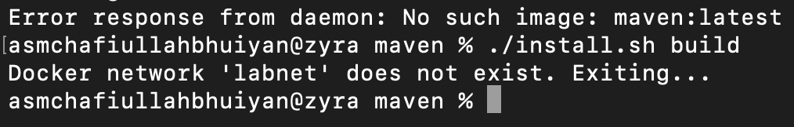

Which is pretty obvious because we have used the same network for the `maven` container. It was not compulsory but an opportunity if you in future you want to do something more. Maybe communicating two container together to build something. So, it is recommend that you build the `mininet and onos` container first.

So, I guess you have built the network. Let's execute the command again:

```bash
# install.sh is the helper script, it should be executable
./install.sh build
```

if everything goes accordingly, you will have such results:

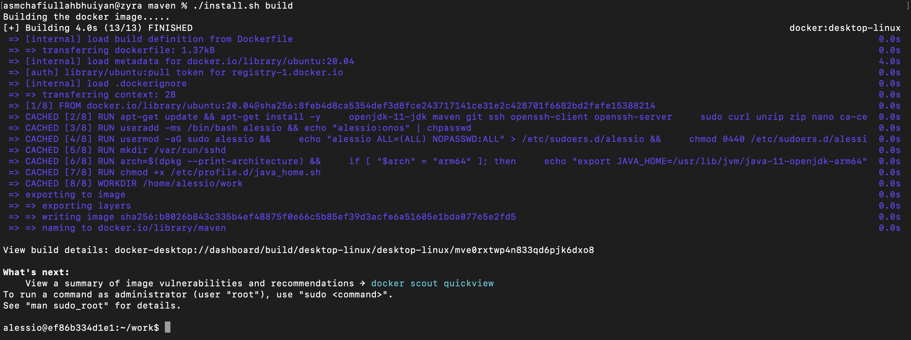

It takes you directly inside the container. Now, note this one thing!

In our [Dockerfile](./Dockerfile) we have simply pulled the `Ubuntu` image which pulls the required `cpu-architecture` from the repository. So, if you are pulling from a `MAC` you are pulling an `arm64` version and from intel/amd it's `x86_64 or amd64`. Why this is important? Because `maven` uses `jdk` and `jdk` has different version for `x86_64 or arm64`. If you face any error regarding `mvn -v`, then check if the `environment` variable for `jdk` is set with appropriate `location` and `name`.

## Loading from the existing maven.tar

The reason I kept a pre-built version is because it requires a lot of dependencies and till this version everything is working with `ONOS`. I don't know what is going to happen in the future with different versions of `Maven`. So, I recommend to use the `pre-built` version.

So, if you have downloaded the `pre-built` version and you have it in the same folder as your `install.sh` script! We are good to go. Remember that the file name must be `maven.tar` otherwise the script fails.

```bash
# to remove previous built
./install.sh clean
./install.sh install
```

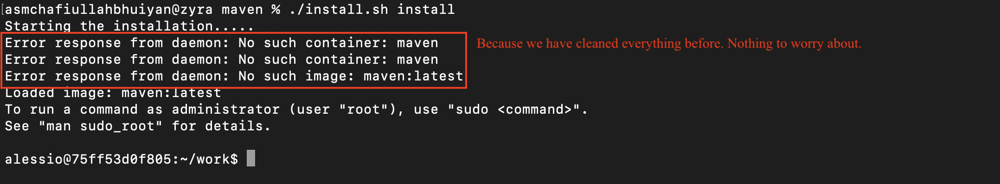

The container is ready and it has a mounted volume with your current directory in your host. So, any required files/folder can be kept here. We will also create our `onos-applications` here.

The `ONOS` application is also provided here in this directory `/work/onos` in case you need any reference class to use in your `onos-app`. Now, it's time to create our `onos-app`.

## UBUNTU container user details

- **Username**: alessio
- **Password**: onos
- sudo rights are given

## Creating ONOS Application

I have provided a script that does is exactly the same thing what `onos-create-app` does. But we will execute this as a script like before, because our `env` variables are not set like we did in the lecture. If you want, maybe you can give it a try. But, for now it serves the purpose. Let's start:

```bash
# alessio@75ff53d0f805:~/work$
cp create_onos_app.sh apps/ # because apps will be created in the apps folder
cd apps # go to the directory
ls # make sure you have the 'create_onos_app.sh' file inside
./create_onos_app.sh app org.name name-app 1.0-SNAPSHOT org.name.app
# will start creating your app
```

Will start downloading the required `maven` dependencies to build your app. But!

## Very important step

When every dependencies will be downloaded and it's time for maven to scaffold your `onos-app`, it will ask you to confirm the current configuration. And in that configuration you will see `onosVersion: 2.7.0` which is automatically set by the script. How?

In the `create_onos_app.sh` script we have set a condition which checks `ONOS_HOME` and then sets that appropriate version but here we are using `ONOS` from another container and there is no `env` variable for `ONOS_HOME`. In that case it is instructed to check remotely in `maven-onos-repository` and set the latest version available. The last version of `ONOS` according to `gerrit` is `2.7.0`. So, if you are using the docker version, **simply put `Y` in the prompt here**.

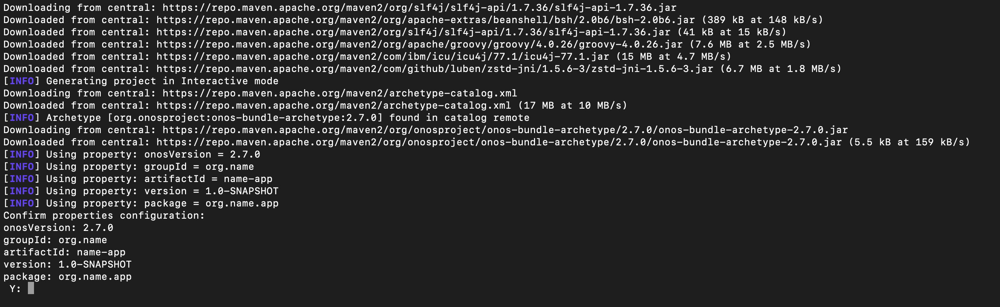

But, for say you are using `onos` local-built and have a different version then:

- first check your `onos` version (you already know how to!)
- **type `N`** in this prompt and press `enter`

at this point you will be asked to define a value for your `onosversion`.

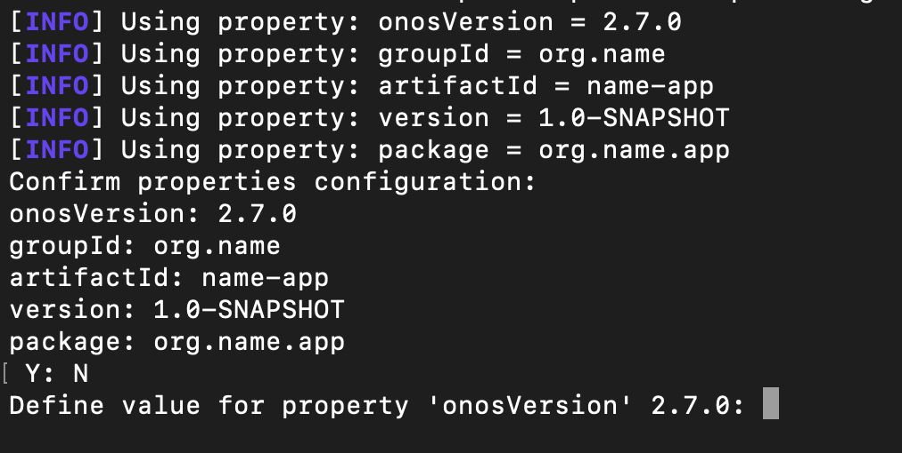

- **type `your onos-version`** (i.e: 2.4.0) in this prompt and press `enter`

If you want to check which versions are available in `maven-repo`:

```bash
# from any directory inside the container bash
mvn org.apache.maven.plugins:maven-archetype-plugin:3.4.0:generate \
  -Dfilter=org.onosproject:
```

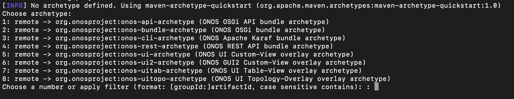

- type `2` because we are building apps

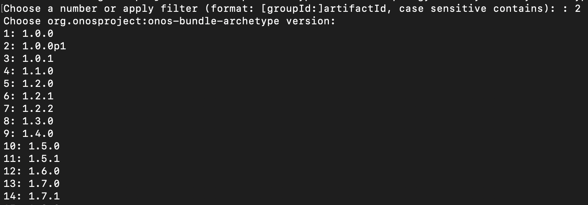

and you have a list with index numbers to choose for your architecture build. Basically these are exactly similar to the `git branches` of `onos-git-repo`. So, you can also check there and select/type your version. But it is important to have the same version as your onos engine, otherwise app fails to be installed inside onos.

## Building the app and generating the `.oar`

Now it's time to build our app using maven:

```bash
# go the apps/name-app directory
cd apps/name-app
# execute the mvn install command
mvn clean install
```

It will take a while to build the application. Once it's done you will see something similar:

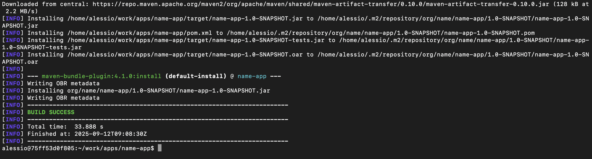

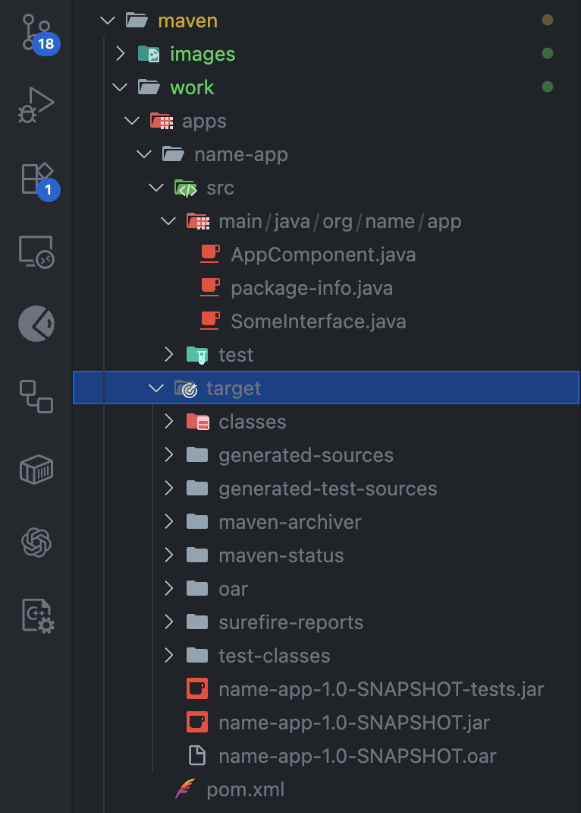

Here you have your required `.oar` file which is required to be uploaded inside `onos` and `AppComponent.java` to build functionalities. 

`Remember that each time you change anything in your code-base you have to build the whole application again: 'mvn clean install' and upload it again`. The rest is well explained during the course by our professor.

## Final step is to upload the `.oar` in onos

Now we will upload our application in `ONOS` using `onos gui`. So, let's go:

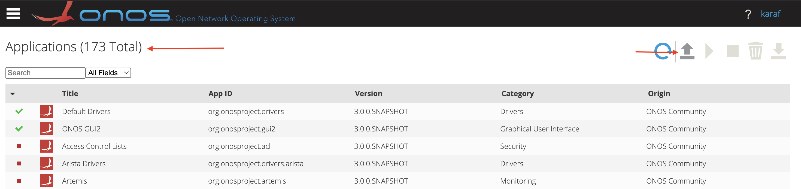

- we have 173 applications now before uploading ours
- let's upload ours from option at top-right corner

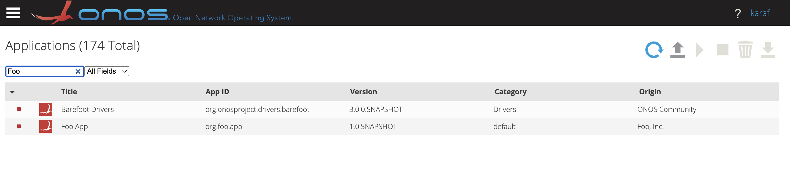

- we have 174 applications now and our `Foo` app(simple) is installed.

That's all! I hope it helps with your course. If there is any issue please report through git and I will try my best to address the issue. Happy Networking!
